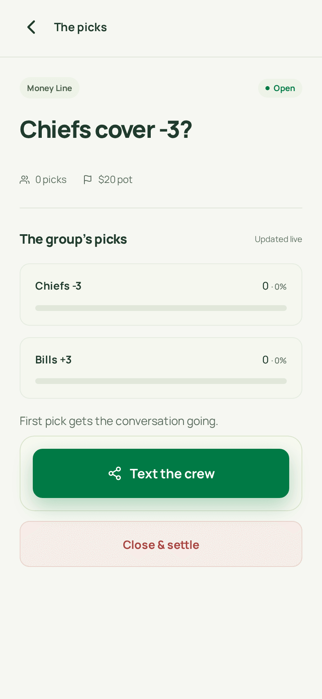
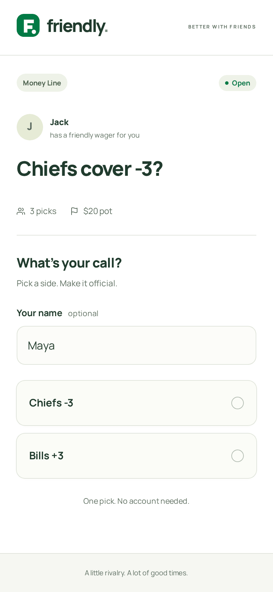
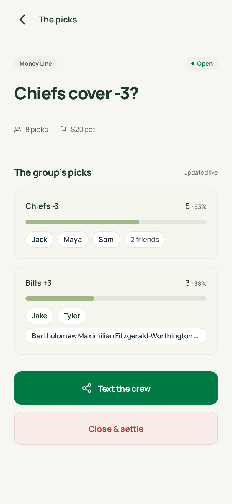
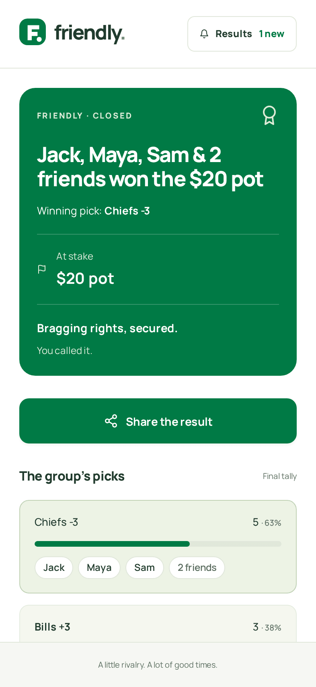

<p align="center">
  
</p>

<h1 align="center">Friendly</h1>

<p align="center">
  <strong>Good times. Better stakes.</strong><br>
  Turn “I bet you” into something official. Make a bet, text your friends, and let it play out.
</p>

<p align="center">
  <a href="https://www.friendly-bets.com"><strong>Start a bet at friendly-bets.com</strong></a>
</p>

<p align="center">
  <a href="https://www.friendly-bets.com"></a>
  
  
</p>

<table align="center">
  <tr>
    <td align="center" width="25%"></td>
    <td align="center" width="25%"></td>
    <td align="center" width="25%"></td>
    <td align="center" width="25%"></td>
  </tr>
  <tr>
    <td align="center"><b>Put the group chat on the line.</b></td>
    <td align="center"><b>What’s your call?</b></td>
    <td align="center"><b>The group’s picks.</b><br>Updated live.</td>
    <td align="center"><b>Bragging rights, secured.</b></td>
  </tr>
</table>

## From “bet?” to “told you.”

1. **Make the call.** Set the question, choices, and stakes. Pick a side, call the number, or make it your own.
2. **Text the crew.** Share a link. Everyone picks a side in one tap.
3. **Settle the score.** Follow the picks as they roll in, then crown the winner.

## Why Friendly

- **Friends only.** No public feed, no strangers. A bet lives behind the link you text your group.
- **No app or account to vote.** Your friends open the link and tap their pick. Adding a name is optional. One pick. No account needed.
- **A live tally.** Watch the picks land as they happen, no refreshing.
- **Winner pings.** When you settle, everyone who picked gets the final word in Friendly, right where they made their pick: “You called it.” for the winners, a friendly “This one’s settled.” for everyone else.
- **Share the result.** One tap sends the final call back to the group chat, with the winners and what was on the line.
- **No money handled.** Friendly keeps score. It never collects, holds, or pays out a cent. The stake is whatever you agree on: a $20 pot, coffee, dinner, or just bragging rights.
- **Bragging rights count.** Leave the stake blank and it’s for bragging rights. Honestly, the best stake there is.

## Free to play

Making your pick is always free. **Founder seats are coming soon** for the folks who start the bets.

The iOS and Android apps are coming soon too. Until then, Friendly works great in your phone’s browser.

## For developers

Next.js on Vercel for the web, the same React screens in a Vite + Capacitor app for iOS and Android, and Firebase (phone sign-in for creators, anonymous sign-in for voters, Firestore for bets).

```bash
npm install && npm run dev
```

Setup, testing, native builds, deploys, and how settlement works: [docs/DEVELOPMENT.md](docs/DEVELOPMENT.md).
